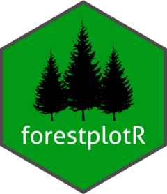

<!-- README.md is generated from README.Rmd. Please edit that file -->

```{r, include = FALSE}
knitr::opts_chunk$set(
  collapse = TRUE,
  comment = "#>",
  fig.path = "man/figures/README-",
  out.width = "100%"
)
```

# forestplotR 

<!-- badges: start -->
[](https://lifecycle.r-lib.org/articles/stages.html#experimental)
[](https://github.com/mglev1n/forestplotR/actions)
<!-- badges: end -->

The goal of `forestplotR` is to enable users to create forest plots from a dataframe

## Installation

You can install the development version of forestplotR from [GitHub](https://github.com/) with:

``` r
# install.packages("devtools")
devtools::install_github("mglev1n/forestplotR")
```

## Usage

This is a basic example of creating a forest plot from an example dataset

```{r dpi = 300, out.width = '80%', fig.align="center"}
library(forestplotR)

plot_forest(mr_res_example, cols_left = dplyr::vars("Protein" = exposure), effect = or, effect_signif = 3, ci_lower = or_lci95, ci_upper = or_uci95, ci_signif = 3, p_value = pval, width_ratio = c(0.5, 3, 1.5), xmin = min(c(1, mr_res_example$or_lci95)), xmax = max(c(1, mr_res_example$or_uci95)), style = "OR")
```
